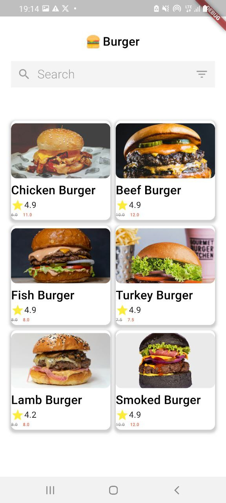
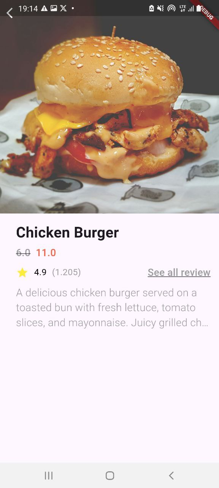

# assesment_app
# Grocery App

This is a Flutter-based grocery app developed for evaluation purposes. The app retrieves a list of grocery items from an API and displays them to the user. Each item can be viewed in detail, and users have the option to add items to their cart.

## Screenshots

## Features

- Fetches grocery items from an API
- Displays detailed information for each item
- Allows users to add items to their cart

## Installation

1. Clone the repository.
2. Open the project in your preferred Flutter development environment.
3. Run the app on an emulator or physical device.

## Usage

1. Launch the app on your device.
2. Browse the available grocery items.
3. Tap on an item to view its details.
4. Use the "Add to Cart" button to add items to your cart.

## Contributing

Contributions are welcome! If you have any suggestions or improvements, please submit a pull request.
